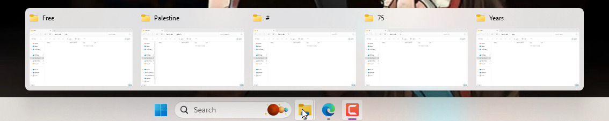
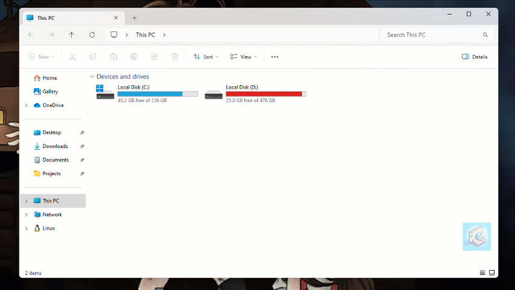
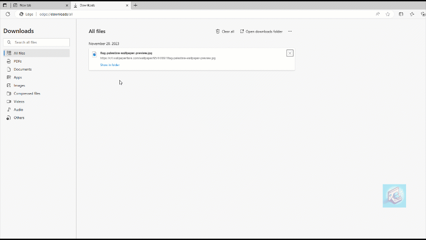
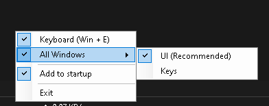

# Explorer Tab Utility
 **Force new `File Explorer's` windows to Tabs:**
 *Intercept `Win+E` keys and `File Explorer's` directory opening to open a new tab instead.*
 
**Note**: The File Explorer's Tabs feature is only available in Windows 11 22H2 Build (22621) or later.

## Why was this made?
To prevent having multiple Explorer windows opened like this:

## Features

- **(`Win + E`) Before:**

- **(`Win + E`) After:**

- **Intercept new window opening:**

- **Show in folder (`Select files`):**

## Usage

1. Download `ExplorerTabUtility` from the [Releases](https://github.com/w4po/ExplorerTabUtility/releases) page.

2. Run the application:

    *A tray icon will be visible with the following options:*

    

    ✅ `All Windows:` If you want to force all new windows to open a new tab instead.

    ✅ `Keyboard (Win + E):` If you want to open new tab when Win+E are pressed.

    ✅ `Add to startup:` If you want the application to start on system startup.

## How does it work?
1. (`Win+E hook`) By setting a global keyboard hook to listen for Win+E

    This way we can catch the keys before a new window is created to prevent it, and then we open a new tab instead (it is much faster than the `All Windows hook`).
2. (`All Windows hook`) By using the [FlaUI](https://github.com/FlaUI/FlaUI) library that wraps the native UI Automation, We use it to hook the `WindowOpenedEvent` event (which is triggered for any new window not just File Explorer).

    We filter that window by it's class name to check if it's a File Explorer window or not.

    If it has the class `CabinetWClass` that means it's a File Explorer window, we then hide the window right away to extract the location and the selected files (if any).
    
    Then we close the window and pass the location and selected files to the next step.

3. We use the same [FlaUI](https://github.com/FlaUI/FlaUI) library to click the `Add new Tab` button in the explorer window, and set the location & select the files (if any).

## Limitations

1. There is a slight delay when a new File Explorer window is opened before we can hide it and extract the location and the selected files.

2. When a File Explorer is already opened in the given directory, Windows just focuses the existing window instead of creating a new one and thus our approach doesn't work.

    *Technically, there is a Window Focused/Activated Event that can detect that, but the user selecting the window could also fire it, which won't be great for normal usage of the File Explorer when needed.*

3. When multiple windows are opened at the same time it takes some time to handle all of them.

4. For multiple virtual desktops it switches back to the one that has an opened File Explorer.

5. We've to click on the window's address bar and sometimes it shows the suggest box and it stays visible.

## What I've tried
I've tried using `Shell.Application` (`Shell32`) instead of `FlaUI` (UI Automation) which could be much faster and cleaner, But sadly Windows Shell only works for the first tab of a window and we can't control it.

## Acknowledgements
[FlaUI](https://github.com/FlaUI/FlaUI)

[File Explorer Interceptor](https://github.com/abdonkov/FileExplorerInterceptor)

[WinENFET](https://github.com/tariibaba/WinENFET)

## License

This project is licensed under the terms of the MIT license.