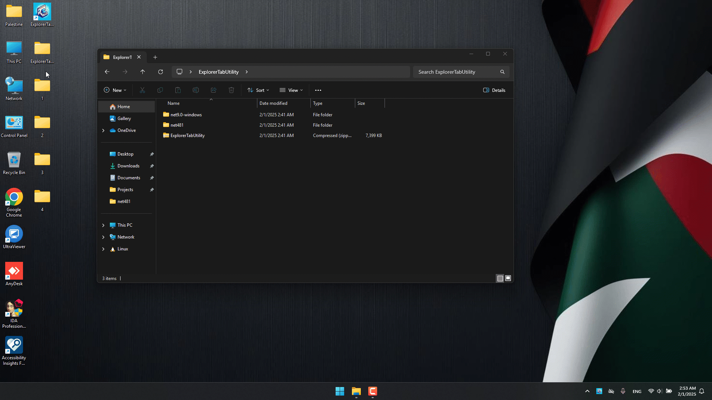
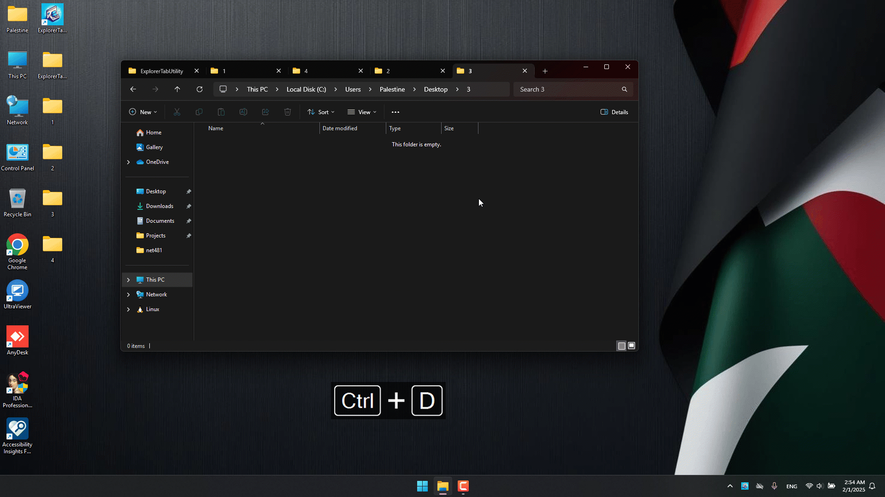
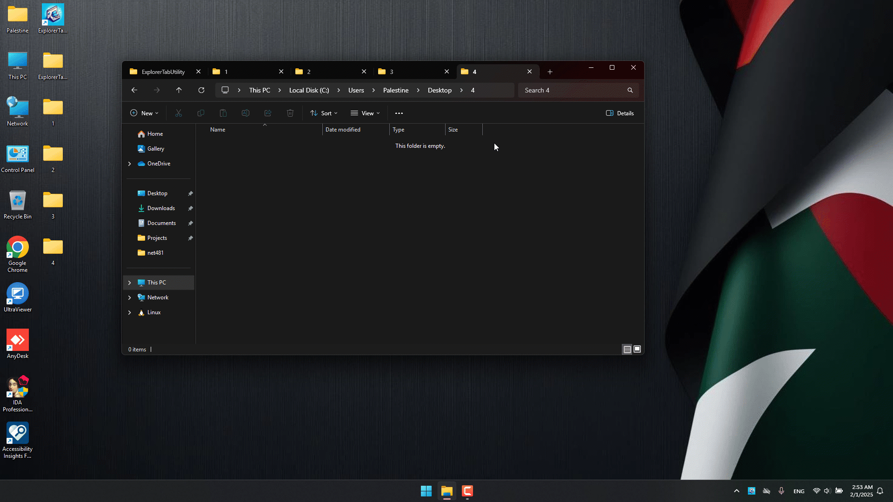
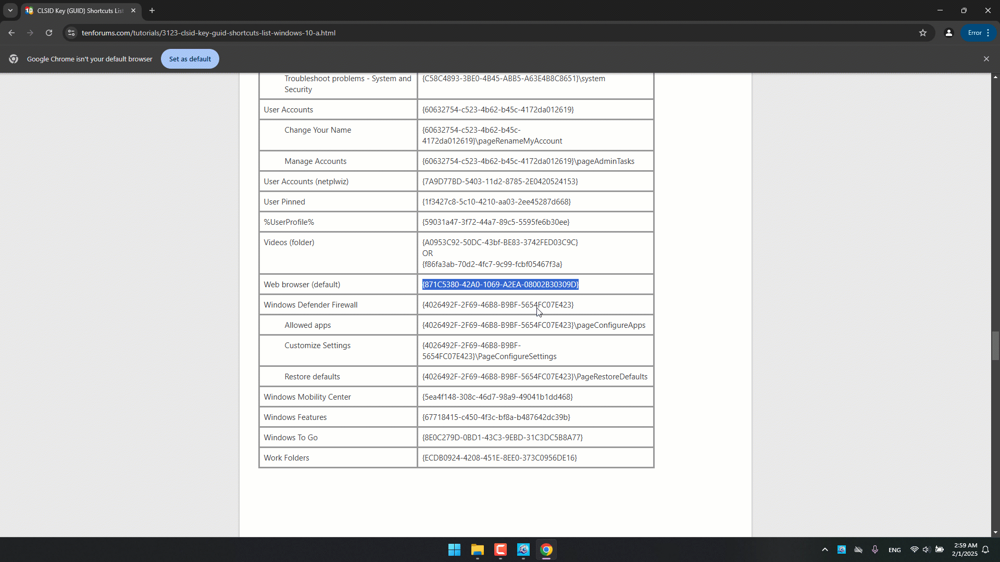
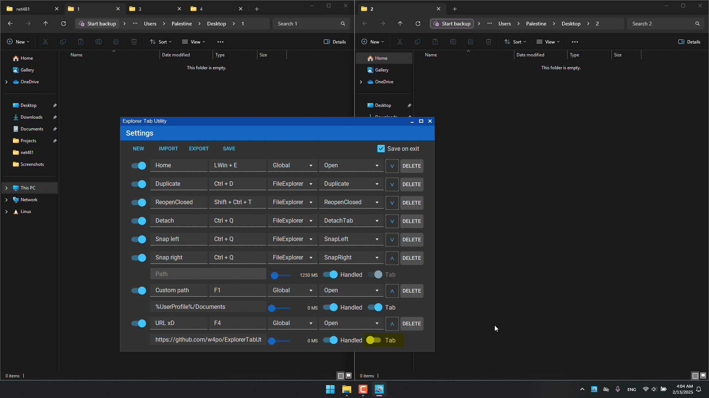
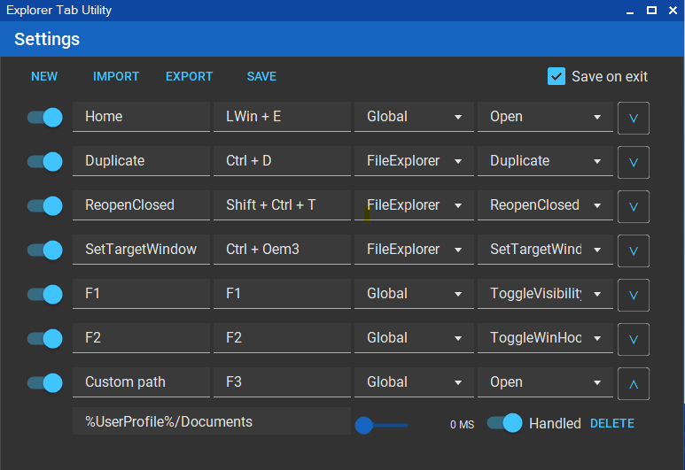

# Explorer Tab Utility

> [!TIP]
> Force new File Explorer windows to open as tabs in Windows 11, making your workflow cleaner and more organized!

<div align="center">
  
  
  [](https://opensource.org/licenses/MIT)
  [](https://www.microsoft.com/windows/windows-11)
  [](https://dotnet.microsoft.com/download)
  [](https://dotnet.microsoft.com/download/dotnet-framework)
</div>

> [!IMPORTANT]
> This application requires Windows 11 (22H2 Build 22621 or later) with the File Explorer Tabs feature.

## 🤔 Why Explorer Tab Utility?

<div align="center">
  
</div>

Say goodbye to cluttered desktops with multiple Explorer windows! Explorer Tab Utility automatically converts new windows into tabs, providing a cleaner and more organized file management experience.

## ✨ Features

<details>
<summary>🔄 Automatic Window to Tab Conversion</summary>

- Seamlessly converts new Explorer windows into tabs
- Switches to existing tabs if path is already opened
- Supports virtual desktop switching with a hotkey
- Supports attaching/detaching tabs
- Handles "Show in folder" file selection elegantly
- Handles opening multiple tabs at once

**See it in action:**


</details>

<details>
<summary>🖨️ Duplicate Current Tab</summary>

- Quickly duplicate the current tab/window
- Choose whether to duplicate as a tab or new window (toggle `Tab` option)
- Preserves the current location and selected items


</details>

<details>
<summary>♻️ Reopen Closed Tabs</summary>

- Reopen previously closed tabs/windows
- Choose whether to reopen as a tab or new window (toggle `Tab` option)
- Restores the exact location and selected items


</details>

<details>
<summary>📋 Detach & Snap Windows</summary>

- Detach current tab to a new window
- Snap windows to screen edges (right/left/top/bottom)
- Chain multiple actions with a single hotkey
- Example setup (CTRL + Q):
  1. First profile: Detach current tab
  2. Second profile: Snap original window to the left
  3. Third profile: Snap new window to the right (with customizable delay)
- Customize delays to match your system's performance


</details>

<details>
<summary>⬅️ Navigate Back</summary>

- Navigate back in File Explorer using:
  - Keyboard shortcuts (customizable)
  - Mouse clicks on any empty space in the folder
- Perfect for quick navigation between directories

</details>

<details>
<summary>📁 Custom Path Navigation</summary>

- Assign hotkeys to quickly open your favorite locations
- Choose whether to open as a tab or new window (toggle `Tab` option)
- Supports multiple formats:
  - Standard paths: `C:\Users\Documents`
  - Environment variables: `%USERPROFILE%\Downloads`
  - Windows CLSID paths: `{A8CDFF1C-4878-43be-B5FD-F8091C1C60D0}` (Special Folders)
  - Programs and files: `C:\file.txt`
  - URLs: `https://github.com/w4po/ExplorerTabUtility` (opens in default browser)
- Perfect for frequently accessed locations
- Instant access to system folders using CLSIDs



</details>

<details>
<summary>⚡ Performance & Reliability</summary>

- Lightweight and resource-efficient
- Fast and responsive tab creation
- Stable COM-based implementation
- Reliable window state management
</details>

## 🚀 Getting Started

1. Download the latest version from the [Releases](https://github.com/w4po/ExplorerTabUtility/releases) page or install it via `winget`:
```powershell
winget install w4po.ExplorerTabUtility
```
2. Run the application
3. Look for the tray icon and you're ready to go!
   

## ⚙️ Configuration

> [!NOTE]
> The application runs in the system tray minimized by default.
> To configure it, double-click or right-click the tray icon.

<details>
<summary>🔧 General Settings</summary>

- **WindowHook**: Enable/disable new windows being converted to tabs
- **ReuseTabs**: Enable/disable reusing existing tabs instead of creating new ones
- **Startup**: Configure automatic startup with Windows
</details>

<details>
<summary>⌨️ Hotkey Profile Management</summary>

### Profile Options
- Create new profiles
- Import profiles from file
- Export profiles to file
- Enable/disable individual profiles

### Profile Settings
Each profile contains the following settings:

1. **Basic Settings**
   - Profile Name
   - Hotkey Combination (set by focusing the input field and pressing desired keys)
   - Scope: Global or Explorer-only (triggers only when File Explorer is focused)

2. **Action Settings**
   - Action Type:
     - `Open`: Open a new tab (optionally with specified path)
     - `Duplicate`: Duplicate current tab
     - `ReopenClosed`: Reopen last closed tab
     - `SetTargetWindow`: Set current Explorer window as the destination for new tabs
     - `ToggleWinHook`: Toggle window hook
     - `ToggleReuseTabs`: Toggle tab reuse
     - `ToggleVisibility`: Toggle form visibility
   - Path Field (for `Open` action)
     - Optional: Leave empty to open new tab
     - Supports multiple path formats (see Custom Path Navigation section)

3. **Advanced Settings**
   - Execution Delay: Slider to set delay before action execution
   - Key Handling: Toggle whether hotkeys are passed to other applications
   - Profile Deletion: Remove unwanted profiles



> [!TIP]
> Use the "Handled" toggle to prevent or allow hotkey propagation to other applications that might be listening for the same key combination.

> [!NOTE]
> The `SetTargetWindow` action lets you choose which Explorer window will receive new tabs. This is useful when you have multiple Explorer windows open or working on different virtual desktops and want to control where new tabs appear.
</details>

## 🔧 Technical Details

<details>
<summary>Implementation Overview</summary>

### Core Components

#### 1. 🔌 COM Integration
- Direct interaction with Windows Shell through native COM interfaces:
  - `Shell32`: Core shell functionality and file system operations
  - `SHDocVw`: Explorer window and tab management
  - Custom COM interface implementations for reliable shell interactions
- Efficient PIDL (Pointer to ID List) handling for file system operations
- Thread-safe COM object lifecycle management

#### 2. 🪟 Window Management
- Advanced window tracking and state management:
  - Concurrent collections for thread-safe window tracking
  - Efficient tab handle caching and validation
  - Smart window-to-tab conversion logic
- Support for special folder navigation (CLSID paths)

#### 3. ⚡ Process & Event System
- Robust Explorer process monitoring:
  - Automatic recovery from Explorer crashes
  - Event-driven architecture for responsive UI
  - Efficient window event hooking
- Asynchronous operation handling:
  - STA (Single-threaded Apartment) task scheduler
  - Non-blocking COM operations
  - Proper synchronization with SemaphoreSlim

#### 4. 🚀 Performance Optimizations
- Smart caching mechanisms:
  - Window handle caching
  - Path comparison optimization
  - Tab state tracking
- Efficient resource management:
  - Proper COM object disposal
  - Memory-efficient collections
  - Minimal window recreation

### Key Technologies
- .NET 9 and .NET Framework 4.8.1
- Windows COM APIs
  - Shell32 and SHDocVw interfaces
  - Native P/Invoke
- Advanced threading with STA scheduler
- Concurrent collections for thread safety
</details>

## Antivirus Detection

> [!WARNING]
> The utility might be flagged by antivirus software as suspicious. This is a **false positive** caused by our use of:
> - COM interactions (for File Explorer tab management)
> - Low-level keyboard & mouse hooks (for hotkey support)
>
> The tool is completely open source, and you can:
> - Review the source code in this repository
> - Build it yourself using Visual Studio
> - Verify its safety and functionality

### Adding to Windows Defender Exclusions

If Windows Defender is blocking the utility, you can add it to the exclusions list:

1. Open Windows Security
2. Go to `Virus & threat protection`
3. Click `Manage settings` under `Virus & threat protection settings`
4. Scroll down to `Exclusions` and click `Add or remove exclusions`
5. Click `Add an exclusion` and select `Folder`
6. Browse to the Explorer Tab Utility folder location

Alternatively, you can use PowerShell (Run as Administrator):
```powershell
Add-MpPreference -ExclusionPath "PATH_TO_UTILITY_FOLDER"
```

## Uninstallation

The utility is portable and can be removed by simply deleting its folder. However:

- If you enabled the `Add to startup` option, make sure to disable it first before deletion
- If you installed via winget, run:
  ```powershell
  winget uninstall w4po.ExplorerTabUtility
  ```

## ℹ️ Notes

> [!NOTE]
> While this utility is optimized for best performance, some operations might experience delays due to limitations in Windows File Explorer itself:
> - The File Explorer's tab interface lacks proper APIs for programmatic control
> - Some operations in File Explorer are inherently laggy, especially with multiple simultaneous window operations
> - Windows Shell doesn't expose all the necessary functionality for seamless tab management

Despite these Windows limitations, the utility implements the best possible solutions using available Windows APIs and COM interfaces.

## 💝 Support the Project

If you find Explorer Tab Utility helpful, consider supporting its development:

<p align="center">
  <a href="https://github.com/sponsors/w4po">
    
  </a>
  <a href="https://www.patreon.com/w4po">
    
  </a>
  <a href="https://www.buymeacoffee.com/w4po">
    
  </a>
  <a href="https://paypal.me/w4po77">
    
  </a>
</p>

Your support helps maintain and improve the project! ❤️

## Contributing

Contributions are welcome! Feel free to submit issues and pull requests.

## License

This project is licensed under the MIT License - see the [LICENSE](LICENSE) file for details.

## Acknowledgements

This project makes use of the following excellent open-source packages:

<p align="center">
  <a href="https://github.com/HavenDV/H.Hooks">
    
  </a>
  <a href="https://github.com/leocb/MaterialSkin">
    
  </a>
</p>

- **[H.Hooks](https://github.com/HavenDV/H.Hooks)** - Efficient and reliable keyboard hook implementation
- **[MaterialSkin.2](https://github.com/leocb/MaterialSkin)** - Beautiful Material Design theming for WinForms

Special thanks to the maintainers of these packages for their excellent work!
